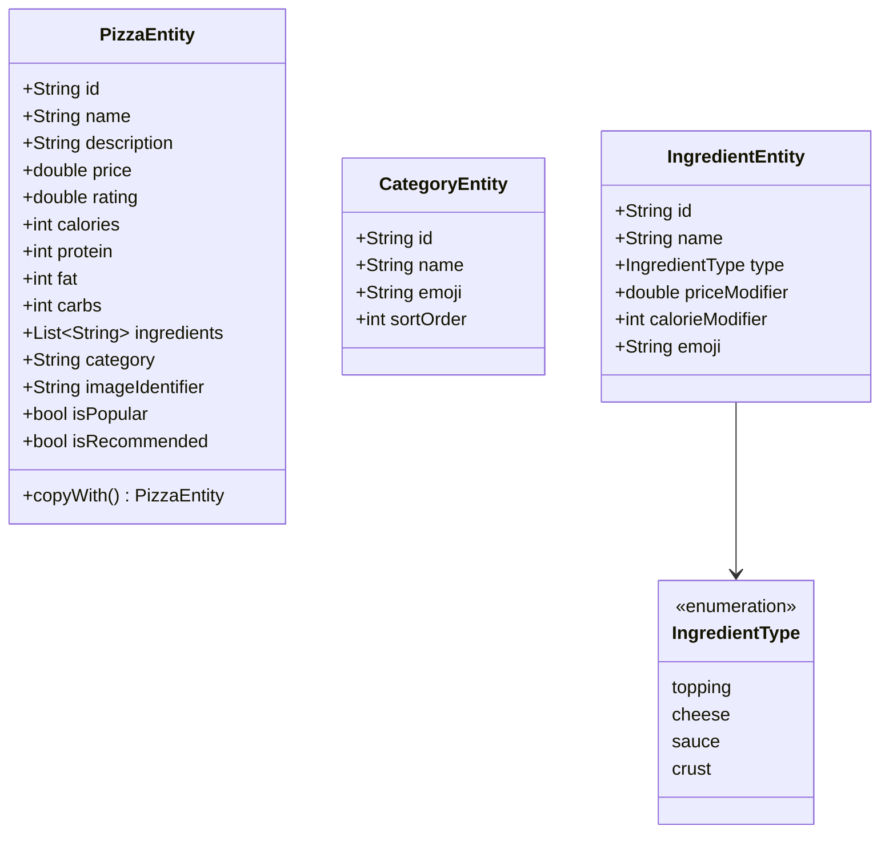
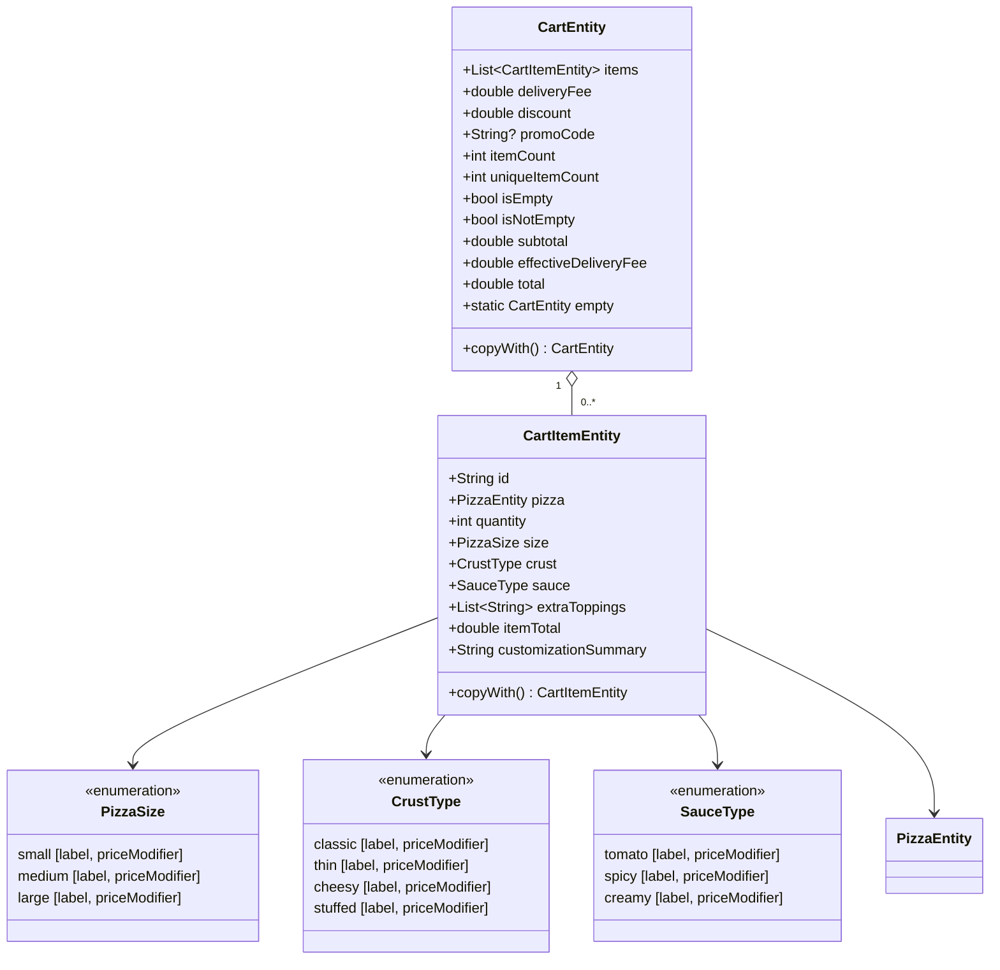
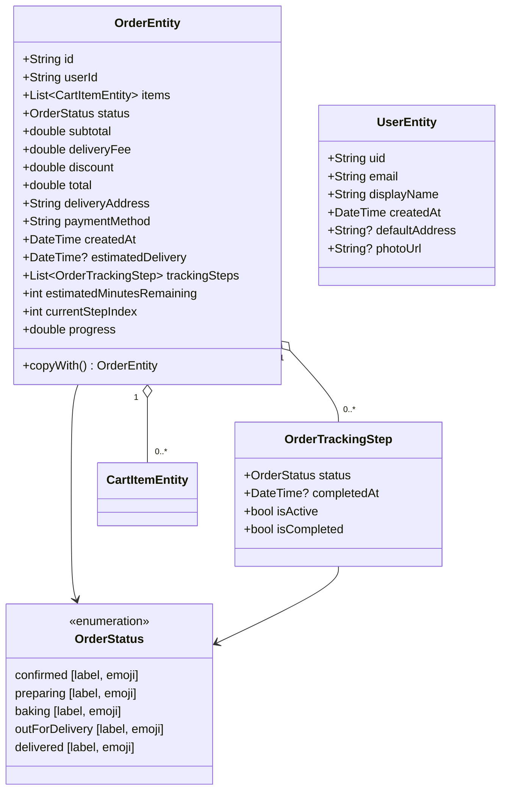
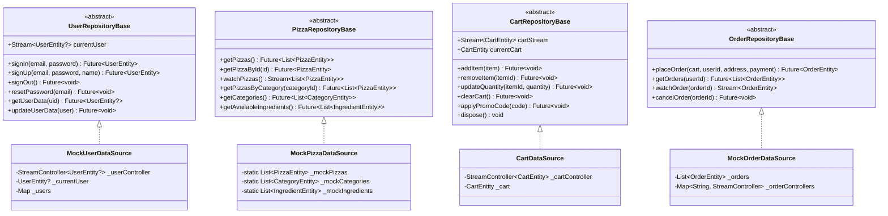
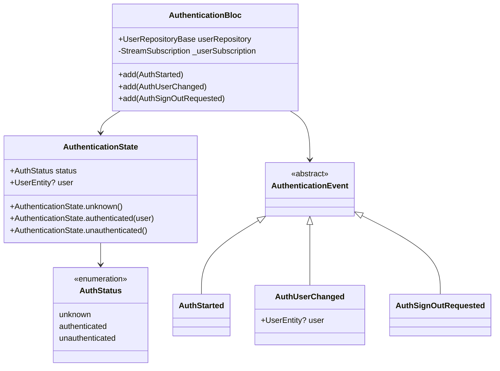
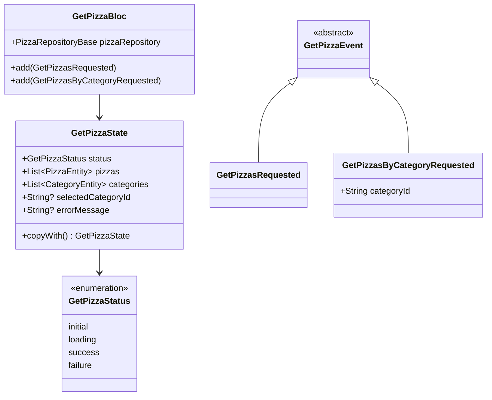
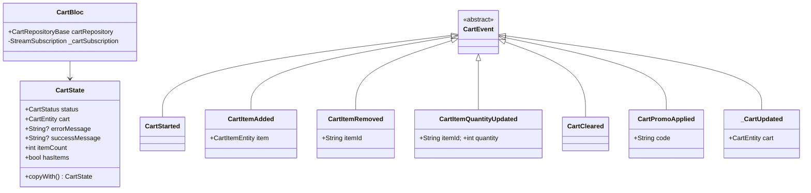
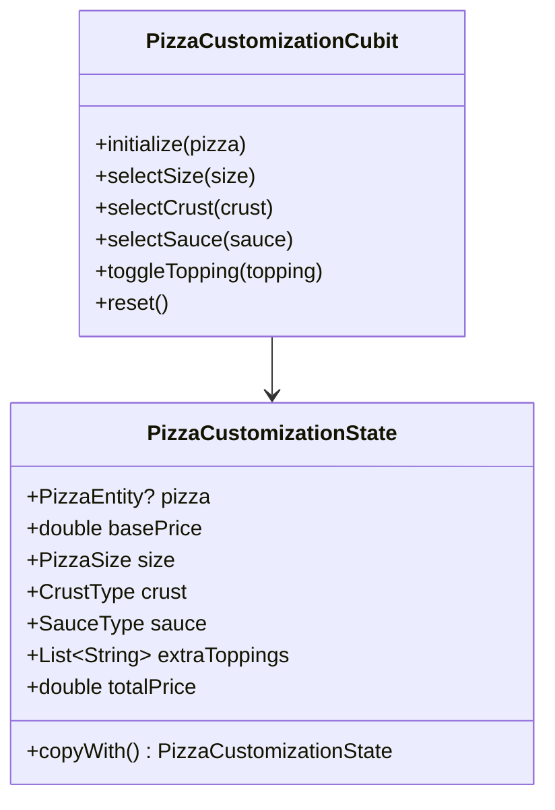
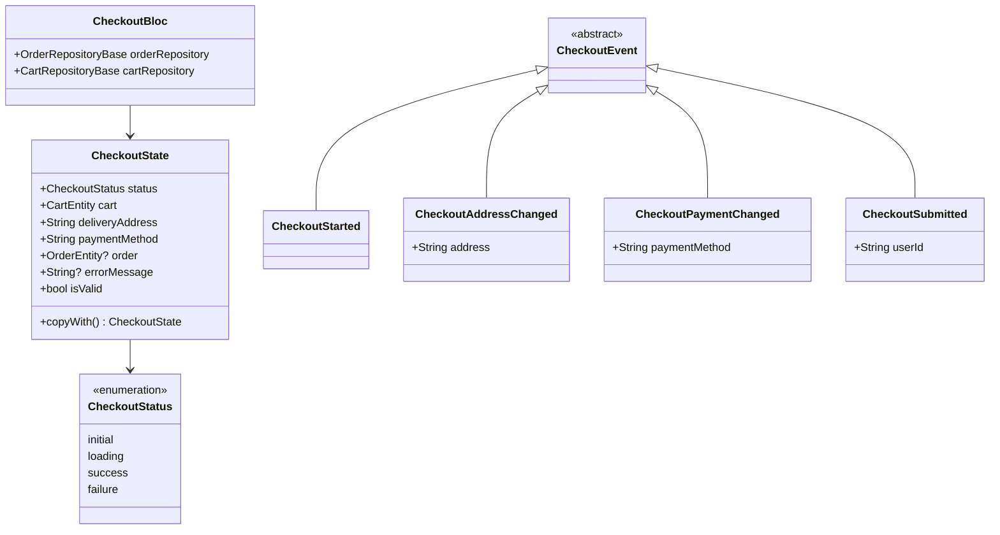

# 03 — Class UML Diagrams

> All diagrams use Mermaid syntax. Paste into any Mermaid renderer (e.g. mermaid.live, GitHub, Notion).

---

## 1. Domain Entities



---

## 2. Cart Entities + Enums



---

## 3. Order Entities



---

## 4. Repository Interfaces



---

## 5. BLoC / Cubit State Machines

### AuthenticationBloc



---

### GetPizzaBloc



---

### CartBloc



---

### PizzaCustomizationCubit



---

### CheckoutBloc



---

## 6. Widget Tree (Key Shared Widgets)

```mermaid
classDiagram

class MarioButton {
  +String label
  +VoidCallback? onPressed
  +bool isLoading
  +IconData? icon
  +Color backgroundColor
  +Color textColor
  +double height
  -AnimationController _controller
  -Animation~double~ _scaleAnimation
  +_onTapDown()
  +_onTapUp()
}

class PizzaIllustration {
  +double size
  +String crust
  +String sauce
  +List~String~ toppings
  +bool animateToppings
}
note for PizzaIllustration "Uses CustomPainter to render\npizza layers: shadow, crust,\nsauce, cheese, toppings"

class PizzaCard {
  +PizzaEntity pizza
  +VoidCallback onTap
  +VoidCallback onQuickAdd
  -AnimationController _addController
  +_handleAddTap()
}

class MarioBottomNav {
  +int currentIndex
  +ValueChanged~int~ onTap
}
note for MarioBottomNav "Reads CartBloc for cart badge count\nContext.select for performance"

class QuantityStepper {
  +int value
  +ValueChanged~int~ onChanged
  +int min
  +int max
}
note for QuantityStepper "Uses AnimatedSwitcher for\ncount change animation"

class OrderTimeline {
  +List~OrderTrackingStep~ steps
}

class MarioLoader {
  +double size
  +String label
}
note for MarioLoader "Rotating 🍕 emoji\nwith AnimationController"

MarioButton --> "AnimationController"
PizzaCard --> PizzaIllustration
PizzaCard --> "AnimationController"
MarioBottomNav --> "CartBloc (select)"
OrderTimeline --> "OrderTrackingStep"
```
