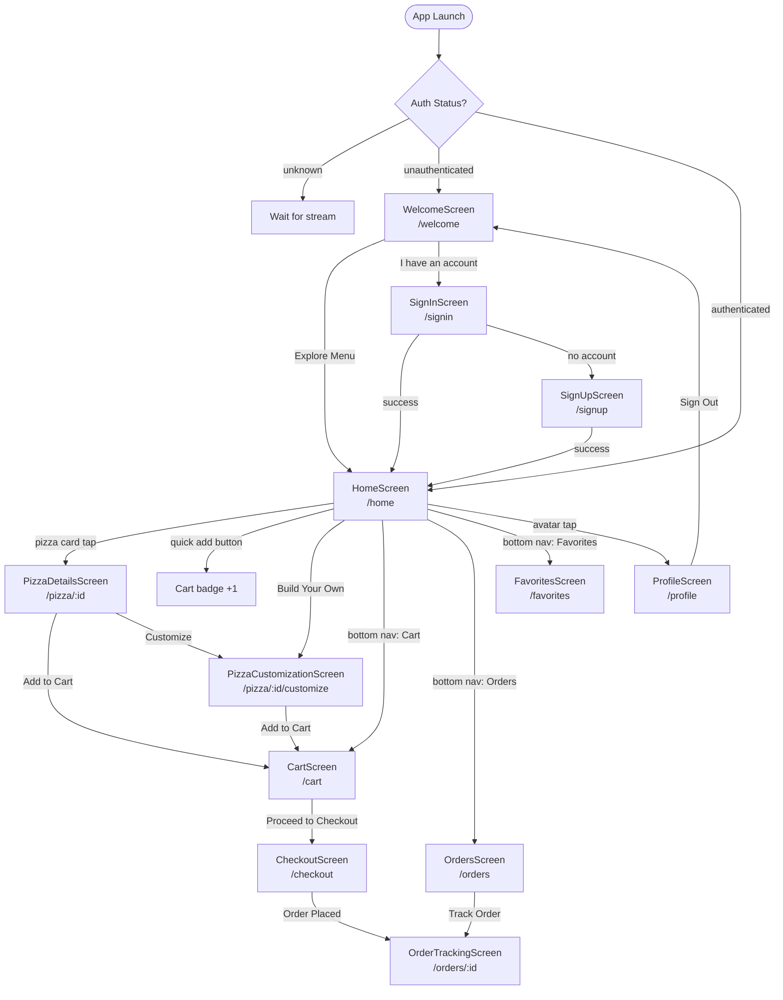
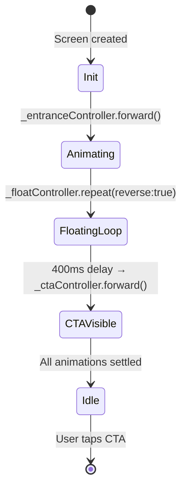
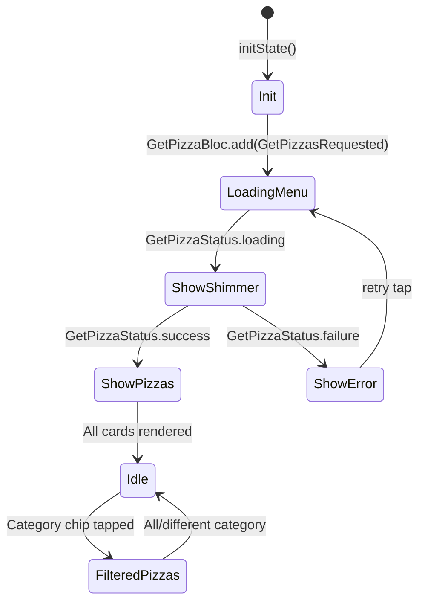
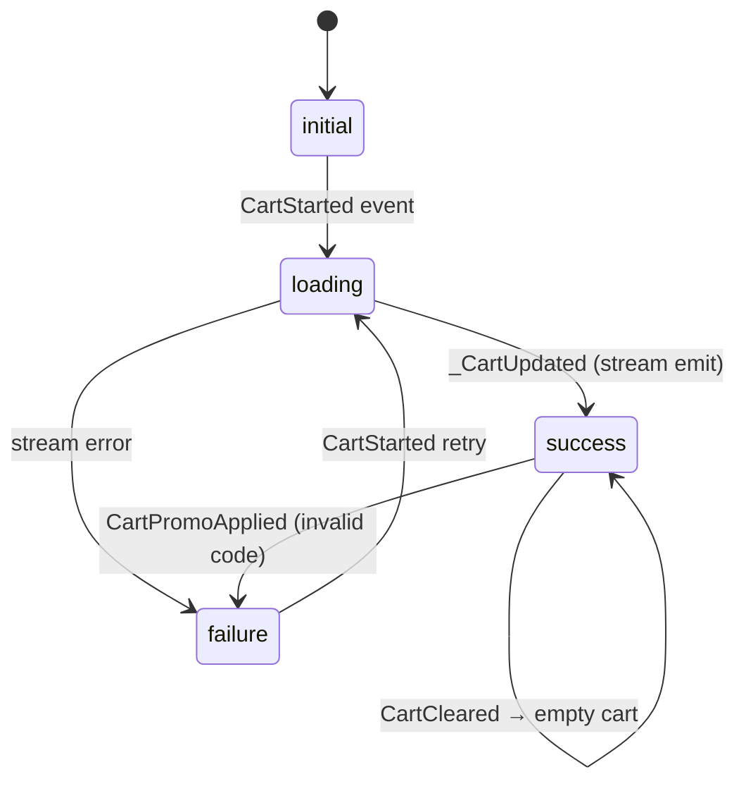
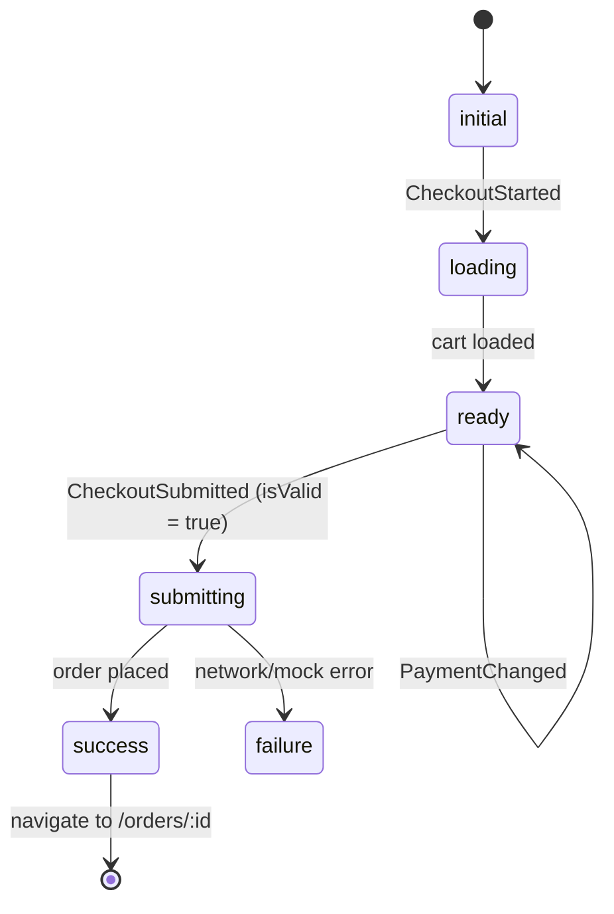
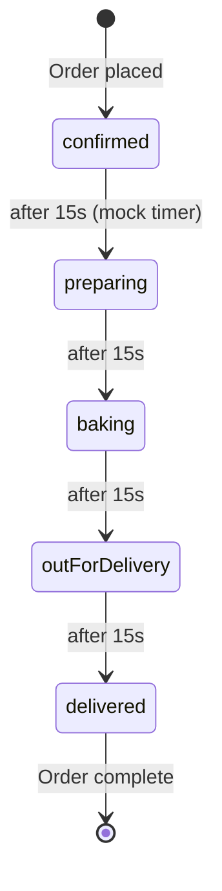

# 04 — Screen Flows & Navigation

## Navigation Flow Diagram



---

## Screen State Machines

### WelcomeScreen — Animation Sequence



### HomeScreen — Load Sequence



### CartBloc — State Machine



### CheckoutBloc — Order Flow



### Order Tracking — Status Progression (Mock)



---

## Screen Component Breakdown

### HomeScreen

```
HomeScreen
├── SafeArea
│   └── RefreshIndicator
│       └── SingleChildScrollView
│           ├── Header (location + avatar) ← animated slide-in
│           ├── Greeting text ← dynamic by time of day
│           ├── _HeroBanner ← rotating pizza + promo text
│           ├── Category chips (horizontal ListView)
│           ├── "Popular Right Now" section header
│           ├── Pizza horizontal ListView
│           │   └── PizzaCard × N (staggered TweenAnimationBuilder)
│           └── _BuildYourOwnBanner ← press scale animation
```

### PizzaDetailsScreen

```
PizzaDetailsScreen
├── AppBar (floating back + favorite buttons)
└── Column
    ├── Expanded → SingleChildScrollView
    │   ├── Container (cream bg) → Hero → PizzaIllustration
    │   └── Padding (content) ← slide+fade animation
    │       ├── Rating + Category row
    │       ├── Pizza name (displayMedium)
    │       ├── Description
    │       ├── Nutrition badges row (4 items)
    │       ├── Ingredients Wrap (Chip × N)
    │       └── OutlinedButton → Customize
    └── Sticky bottom bar
        ├── Price column
        └── MarioButton ("Add to Cart" / "✓ Added!")
```

### CartScreen

```
CartScreen
├── AppBar (title + clear all icon)
└── BlocBuilder~CartBloc~
    ├── (empty) → MarioEmptyState → Browse Pizzas
    └── (has items) → Column
        ├── Expanded → ListView
        │   └── CartItem × N ← TweenAnimationBuilder stagger
        │       ├── PizzaIllustration (size: 70)
        │       ├── Name + customization summary
        │       ├── Price
        │       └── QuantityStepper
        └── Sticky bottom panel
            ├── Promo code input
            ├── Price breakdown (subtotal, delivery, discount, total)
            └── MarioButton → /checkout (context.push)
```

---

## Bottom Navigation Tabs

| Index | Label | Icon | Route |
|-------|-------|------|-------|
| 0 | Home | home_rounded | `/home` |
| 1 | Explore | explore_rounded | `/explore` |
| 2 | Orders | receipt_long_rounded | `/orders` |
| 3 | Favorites | favorite_rounded | `/favorites` |
| 4 | Cart | shopping_bag_rounded | `/cart` (has badge) |
