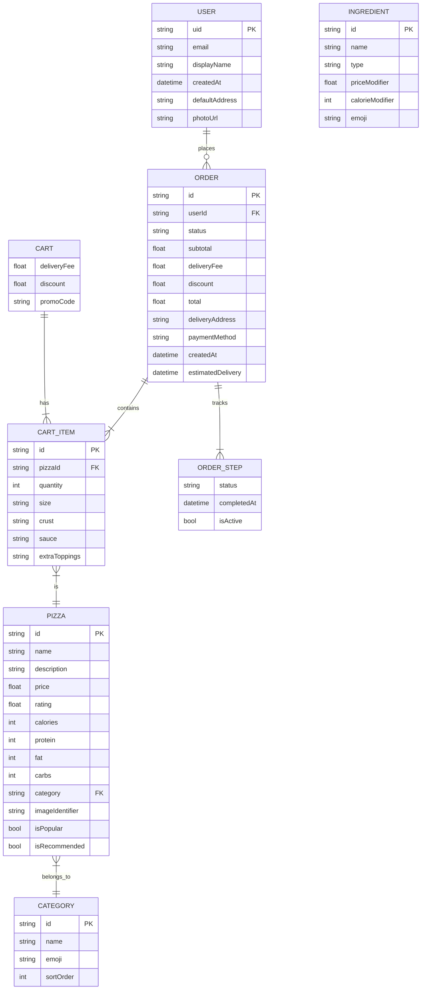
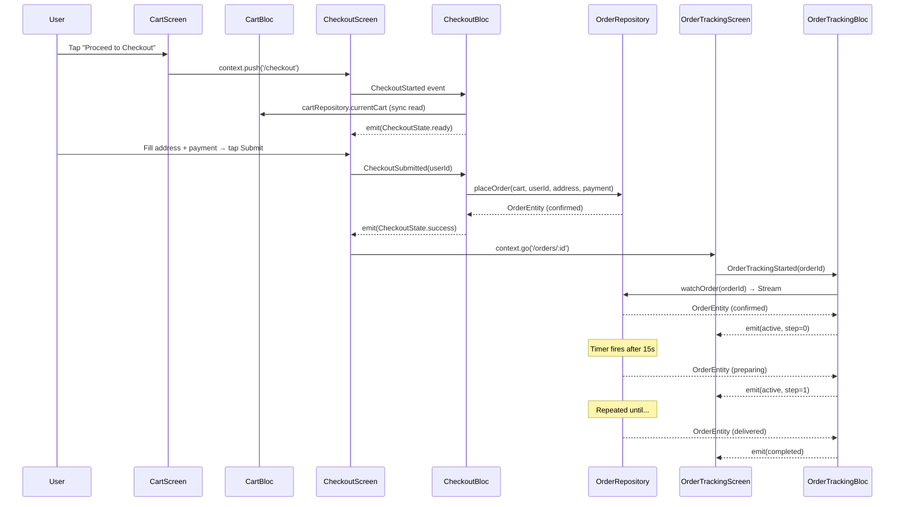

# 05 — Data Layer

## Repository Pattern Overview

Every data operation goes through a **repository interface** (abstract class). The UI and BLoCs only
know about the interface — they never import a concrete implementation.

```
BLoC/Cubit
   └── depends on → RepositoryBase (abstract)
                          └── implemented by
                                ├── MockDataSource (no Firebase needed)
                                └── FirebaseDataSource (production)
```

Switching from Mock to Firebase requires only changing **one line** in `service_locator.dart`:

```dart
// BEFORE (mock)
sl.registerFactory<UserRepositoryBase>(() => MockUserDataSource());

// AFTER (firebase)
sl.registerFactory<UserRepositoryBase>(() => FirebaseUserDataSource(
  firebaseAuth: FirebaseAuth.instance,
  firestore: FirebaseFirestore.instance,
));
```

---

## Entity Relationships



---

## Mock Data Seed

### MockUserDataSource
- Pre-loaded demo user at startup: `demo@mario.com / Password123`
- **Auto signs in** in development — user is authenticated immediately
- Any email/password combo creates a new mock user (no validation)

### MockPizzaDataSource
- 8 hardcoded `PizzaEntity` objects (const, no I/O)
- Simulates API latency with `Future.delayed`:
  - `getPizzas()`: 600ms
  - `getPizzaById()`: 300ms
  - `getPizzasByCategory()`: 400ms
  - `getCategories()`: 200ms

### CartDataSource (always in-memory, no mock/real split)
- Backed by a `StreamController<CartEntity>.broadcast()`
- Cart state lives only in RAM — clears on app restart
- Promo codes: `MARIO10`, `PIZZA5`, `FREESHIP`
- Free delivery when subtotal ≥ $25.00

### MockOrderDataSource
- Places orders as in-memory objects
- Auto-advances order status every ~15 seconds via a `Timer`
- Broadcasts status changes through individual `StreamController`s per orderId
- Returns live `Stream<OrderEntity>` for real-time tracking UI

---

## Data Flow: Complete Pizza Order



---

## Code: Key Data Structures

### CartEntity computed properties
```dart
class CartEntity extends Equatable {
  final List<CartItemEntity> items;
  final double deliveryFee;   // default: $2.99
  final double discount;
  final String? promoCode;

  // Free delivery when subtotal >= $25
  double get effectiveDeliveryFee => subtotal >= 25.00 ? 0.0 : deliveryFee;

  // Grand total
  double get total => subtotal + effectiveDeliveryFee - discount;

  // Count including quantity multipliers
  int get itemCount => items.fold(0, (sum, item) => sum + item.quantity);
}
```

### CartItemEntity price calculation
```dart
double get itemTotal {
  final basePrice  = pizza.price;
  final sizeExtra  = size.priceModifier;    // 0 / 2.00 / 4.00
  final crustExtra = crust.priceModifier;   // 0 / 0 / 1.50 / 2.50
  final sauceExtra = sauce.priceModifier;   // 0 / 0.50 / 0.50
  final toppingsExtra = extraToppings.length * 1.00;  // $1 per topping
  return (basePrice + sizeExtra + crustExtra + sauceExtra + toppingsExtra) * quantity;
}
```

### OrderEntity progress tracking
```dart
// Index of current status in enum (0=confirmed, 4=delivered)
int get currentStepIndex => OrderStatus.values.indexOf(status);

// Progress bar fraction (0.0 → 1.0)
double get progress => (currentStepIndex + 1) / OrderStatus.values.length;

// Countdown timer
int get estimatedMinutesRemaining {
  if (estimatedDelivery == null) return 0;
  final remaining = estimatedDelivery!.difference(DateTime.now()).inMinutes;
  return remaining > 0 ? remaining : 0;
}
```

---

## Firestore Schema (Production — Not Yet Active)

```
/users/{uid}
  uid: string
  email: string
  displayName: string
  createdAt: timestamp
  defaultAddress: string?
  photoUrl: string?

/pizzas/{pizzaId}
  (all PizzaEntity fields)
  createdAt: timestamp

/orders/{orderId}
  userId: string (ref → /users/{uid})
  status: string (OrderStatus.name)
  items: array of CartItemEntity maps
  subtotal: number
  deliveryFee: number
  discount: number
  total: number
  deliveryAddress: string
  paymentMethod: string
  createdAt: timestamp
  estimatedDelivery: timestamp

/orders/{orderId}/trackingSteps/{stepId}
  status: string
  completedAt: timestamp?
  isActive: bool
```
